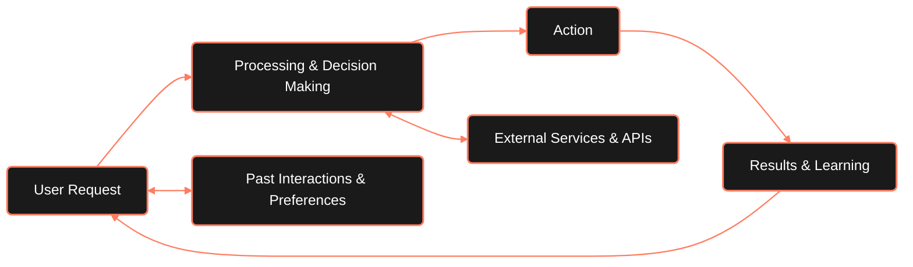

---

## Introduction

An AI Agent is a software program that works on your behalf to complete tasks based on goals you set. It observes information, makes decisions on its own, and takes actions to accomplish objectives. Unlike basic AI tools that only provide recommendations, an agent can execute tasks independently. It learns from its experiences and adapts its approach to better achieve the goals you've defined.

<Note>
	The key difference between AI Agents and traditional tools is autonomy -
	they can make decisions and take actions without continuous human guidance.
</Note>

---

## How an AI Agent Works?

<Steps>
	<Step title='Gathering Information' stepNumber={1} icon='eye'>
		The agent collects data from various sources - this might be your
		question, information from websites, or data you've provided. Think of
		this as the agent's "eyes and ears" that help it understand what needs
		to be done.
	</Step>
	<Step title='Processing and Decision Making' stepNumber={2} icon='brain'>
		Using powerful AI models (like large language models), the agent
		analyzes the information and determines the best approach. It weighs
		different options and plans out the steps needed to complete your task
		successfully.
	</Step>
	<Step title='Taking Action' stepNumber={3} icon='rocket'>
		Unlike basic AI tools that just give suggestions, an agent actually
		performs the tasks. It might send messages, search for information,
		create content, or interact with other systems to get things done for
		you.
	</Step>
</Steps>

<Tip>
	The beauty of AI agents is their ability to work independently once you set
	a goal. They follow this **sense-think-act** cycle continuously, adapting as
	needed until they accomplish what you've asked them to do - all without
	requiring your constant guidance for each step.
</Tip>

---

## Chatbots vs Gen AI vs AI Agents

	<table className='w-full border-collapse'>
		<thead className='bg-zinc-900'>
			<tr>
				<th className='border border-zinc-700 p-3 text-left'>
					Feature
				</th>
				<th className='border border-zinc-700 p-3 text-center'>
					Chatbots
				</th>
				<th className='border border-zinc-700 p-3 text-center'>
					Generative AI
				</th>
				<th className='border border-zinc-700 p-3 text-center'>
					AI Agents
				</th>
			</tr>
		</thead>
		<tbody>
			<tr>
				<td className='border border-zinc-700 p-3'>Answer Questions</td>
				<td className='border border-zinc-700 p-3 text-center'>✅</td>
				<td className='border border-zinc-700 p-3 text-center'>✅</td>
				<td className='border border-zinc-700 p-3 text-center'>✅</td>
			</tr>
			<tr>
				<td className='border border-zinc-700 p-3'>Create Content</td>
				<td className='border border-zinc-700 p-3 text-center'>❌</td>
				<td className='border border-zinc-700 p-3 text-center'>✅</td>
				<td className='border border-zinc-700 p-3 text-center'>✅</td>
			</tr>
			<tr>
				<td className='border border-zinc-700 p-3'>Take Actions</td>
				<td className='border border-zinc-700 p-3 text-center'>❌</td>
				<td className='border border-zinc-700 p-3 text-center'>❌</td>
				<td className='border border-zinc-700 p-3 text-center'>✅</td>
			</tr>
			<tr>
				<td className='border border-zinc-700 p-3'>Make Decisions</td>
				<td className='border border-zinc-700 p-3 text-center'>❌</td>
				<td className='border border-zinc-700 p-3 text-center'>❌</td>
				<td className='border border-zinc-700 p-3 text-center'>✅</td>
			</tr>
			<tr>
				<td className='border border-zinc-700 p-3'>Learn & Adapt</td>
				<td className='border border-zinc-700 p-3 text-center'>❌</td>
				<td className='border border-zinc-700 p-3 text-center'>
					✅ (Limited)
				</td>
				<td className='border border-zinc-700 p-3 text-center'>✅</td>
			</tr>
		</tbody>
	</table>

---

## What Can AI Agents Actually Do For You?

AI Agents can handle all sorts of everyday tasks:

<Tabs>
	<Tab title='Personal Management'>
		<Card title='Schedule meetings' icon='calendar-check' horizontal>
			Schedule meetings and send invites automatically without manual
			intervention
		</Card>

    	<Card title='Manage your calendar' icon='calendar' horizontal>
    		Manage your calendar and suggest optimal time management
    		strategies
    	</Card>

    	<Card title='Remind you of deadlines' icon='bell' horizontal>
    		Remind you of important deadlines and follow-ups at the right
    		time
    	</Card>

    	<Card title='Create to-do lists' icon='list-check' horizontal>
    		Create and organize to-do lists based on priorities and deadlines
    	</Card>
    </Tab>

    <Tab title='Shopping & Research'>
    	<Card title='Find the best deals' icon='magnifying-glass' horizontal>
    		 Search across websites for the best deals on products you want
    	</Card>

    	<Card title='Compare products' icon='chart-bar' horizontal>
    		 Compare products based on your specific preferences and
    		requirements
    	</Card>

    	<Card title='Place orders & track' icon='boxes-stacked' horizontal>
    	Place orders and track deliveries across multiple platforms
    	</Card>

    	<Card title='Monitor price drops' icon='chart-line' horizontal>
    	Monitor price drops on items you're interested in and alert you
    	</Card>
    </Tab>

    <Tab title='Home Automation'>
    	<Card title='Control smart devices' icon='house' horizontal>
    		 Control smart devices based on your habits and preferences
    	</Card>

    	<Card title='Adjust environment' icon='lightbulb' horizontal>
    		 Adjust temperature and lighting for comfort and efficiency
    	</Card>

    	<Card title='Order supplies' icon='cart-shopping' horizontal>
    		 Order groceries when supplies run low without manual intervention
    	</Card>

    	<Card title='Manage security' icon='shield-check' horizontal>
    		 Manage security systems and alerts for your home
    	</Card>
    </Tab>

    <Tab title='Finance Management'>
    	<Card title='Pay bills on time' icon='file-invoice-dollar' horizontal>
    		💸 Pay bills on time without missing deadlines
    	</Card>

    	<Card
    		title='Flag unusual expenses'
    		icon='triangle-exclamation'
    		horizontal>
    		 Flag unusual expenses and potential fraud activity
    	</Card>

    	<Card title='Create budgets' icon='square-list' horizontal>
    	 Help create and stick to budgets based on your financial goals
    	</Card>

    	<Card title='Suggest savings' icon='piggy-bank' horizontal>
    	 Suggest savings opportunities and investment options
    	</Card>
    </Tab>

</Tabs>

<Warning>
	This isn't an exhaustive list of applications. AI Agents are continuously
	evolving with new capabilities and use cases emerging across different
	industries and personal scenarios.
</Warning>

---

## What's Next for AI Agents?
AI agents are on the verge of a major leap, moving beyond simple automation to handling real financial transactions. Until now, they’ve been restricted from handling real money, but with **Payman AI**, they can now securely make payments, purchase items, and automate transactions. This breakthrough ensures safety, compliance, and smart spending, making AI agents truly autonomous. 

The future isn’t just about AI completing tasks, it’s about AI managing finances seamlessly and responsibly.

