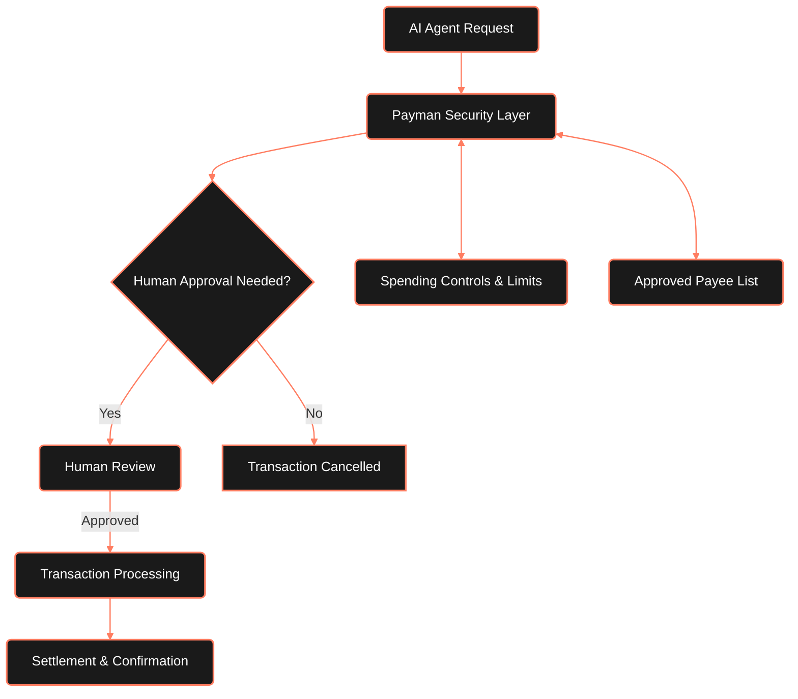

---

## Introduction

Payman AI is the specialized financial infrastructure that empowers AI Agents to move money securely and efficiently. With built-in compliance, human oversight, and seamless integration, it's the foundation that developers need to trust AI with financial transactions. Payman bridges the critical gap between autonomous AI capabilities and real-world financial operations.

<Note>
	Payman AI doesn't require AI to have full autonomy - just the right
	financial tools with appropriate safeguards and controls.
</Note>

---

## Why Payman AI?

 Traditional payment infrastructures weren't designed for AI autonomy, creating significant security risks when adapted for AI use. Payman AI was built from the ground up specifically for AI financial operations, with **3 core principles**.

---

## Core Principles

<Tabs>
	<Tab title='AI-First Design'>
		<Card title='Designed for AI Agents' icon='robot' horizontal>
			Powerful features designed specifically for AI workflows and autonomous operations
		</Card>

    	<Card title='Seamless Integrations' icon='puzzle-piece' horizontal>
    		Built to work with the AI frameworks and tools you already use
    	</Card>

    	<Card title='Intuitive API' icon='code' horizontal>
    		Developer-friendly interface designed for straightforward implementation
    	</Card>
    </Tab>

    <Tab title='Human Collaboration'>
    	<Card title='Human-in-Loop Approvals' icon='user-check' horizontal>
    		 Customizable workflows for reviewing and approving AI-initiated transactions
    	</Card>

    	<Card title='Approval Thresholds' icon='scale-balanced' horizontal>
    		 Set approval requirements based on transaction size, recipient, or other criteria
    	</Card>

    	<Card title='Flexible Control' icon='sliders' horizontal>
    		Choose the right balance between autonomy and oversight for your specific needs
    	</Card>
    </Tab>

    <Tab title='Built-in Safety'>
    	<Card title='Separate Financial Accounts' icon='wallet' horizontal>
    		 Dedicated AI accounts completely isolated from your primary funding source
    	</Card>

    	<Card title='Smart Payee Protection' icon='shield-check' horizontal>
    		 Pre-approved payee lists ensure AI can only send funds to authorized recipients
    	</Card>

    	<Card title='Enterprise Compliance' icon='file-certificate' horizontal>
    		 Bank-grade security and comprehensive compliance controls
    	</Card>
    </Tab>

</Tabs>

---

## The Problem Payman Solves

	<table className='w-full border-collapse'>
		<thead className='bg-zinc-900'>
			<tr>
				<th className='border border-zinc-700 p-3 text-left'>
					Challenge
				</th>
				<th className='border border-zinc-700 p-3 text-left'>
					Without Payman
				</th>
				<th className='border border-zinc-700 p-3 text-left'>
					With Payman
				</th>
			</tr>
		</thead>
		<tbody>
			<tr>
				<td className='border border-zinc-700 p-3'>
					Financial Access for AI
				</td>
				<td className='border border-zinc-700 p-3'>
					Risky direct access to accounts or manual human intervention
					for every transaction
				</td>
				<td className='border border-zinc-700 p-3'>
					Secure, limited access with proper controls and automated
					safeguards
				</td>
			</tr>
			<tr>
				<td className='border border-zinc-700 p-3'>
					Security & Control
				</td>
				<td className='border border-zinc-700 p-3'>
					Difficult to implement proper safeguards; high risk of
					errors or misuse
				</td>
				<td className='border border-zinc-700 p-3'>
					Multi-layered security built-in with spending limits,
					approved payees, and human oversight
				</td>
			</tr>
			<tr>
				<td className='border border-zinc-700 p-3'>Compliance</td>
				<td className='border border-zinc-700 p-3'>
					Complex regulatory requirements difficult to implement
					properly
				</td>
				<td className='border border-zinc-700 p-3'>
					Enterprise-grade compliance built into every transaction
					with full audit trails
				</td>
			</tr>
			<tr>
				<td className='border border-zinc-700 p-3'>AI Integration</td>
				<td className='border border-zinc-700 p-3'>
					Payment systems not designed for AI workflows and autonomous
					operations
				</td>
				<td className='border border-zinc-700 p-3'>
					Built for AI with intuitive APIs and framework integrations
				</td>
			</tr>
		</tbody>
	</table>

---

## Payment Capabilities

    	<Card title='US ACH Transfers' icon='building-columns' horizontal>
    		Standard bank transfers for paying vendors, services, and more with 1-2 business day settlement
    	</Card>

    	<Card title='Agent-to-Agent Transfers' icon='arrows-left-right' horizontal>
    		 Instant, zero-fee transfers between AI Agents on the Payman network
    	</Card>

    	<Card title='Crypto Payments (Coming Soon)' icon='bitcoin-sign' horizontal>
    		 Support for cryptocurrency transactions with integrated compliance
    	</Card>

---

## Security Features

Payman AI provides multiple layers of security to ensure AI financial operations remain safe and controlled:

<CardGroup cols={2}>
	<Card title='Smart Payee Protection' icon='shield-check'>
		

			Restrict which recipients your AI can send payments to with
			pre-approved payee lists.
		

		<ul className='pl-5 list-disc space-y-1'>
			<li>• Whitelist trusted recipients</li>
			<li>• Block unauthorized transactions</li>
			<li>• Prevent accidental payments</li>
		</ul>
	</Card>

    <Card title='Spending Controls' icon='gauge-max'>
    	

    		Set precise limits on your AI Agent's spending capabilities.
    	

    	<ul className='pl-5 list-disc space-y-1'>
    		<li>• Daily and monthly limits</li>
    		<li>• Per-transaction maximums</li>
    		<li>• Category-based restrictions</li>
    	</ul>
    </Card>

    <Card title='Human-in-Loop Approvals' icon='user-check'>
    	

    		Customizable approval workflows for AI-initiated transactions.
    	

    	<ul className='pl-5 list-disc space-y-1'>
    		<li>• Approval thresholds</li>
    		<li>• Multi-level authorization</li>
    		<li>• Conditional approval rules</li>
    	</ul>
    </Card>

    <Card title='Secure Fund Orchestration' icon='arrows-to-circle'>
    	
Intelligent fund management for AI operations.

    	<ul className='pl-5 list-disc space-y-1'>
    		<li>• Dedicated AI accounts</li>
    		<li>• Predictive funding</li>
    		<li>• Protected primary accounts</li>
    	</ul>
    </Card>
</CardGroup>

---

## Enterprise Features

For organizations requiring advanced security, compliance, and integration capabilities:

<CardGroup cols={3}>
	<Card title='SOC 2 Compliance'>
		Comprehensive security certification ensuring your financial data is
		protected to the highest standards
	</Card>

    <Card title='Custom Integrations'>
    	Enterprise-level support for custom integrations with your existing
    	financial and operational systems
    </Card>

    <Card title='Advanced Reporting'>
    	Comprehensive analytics and reporting capabilities for financial
    	oversight and optimization
    </Card>

    <Card title='Role-Based Access'>
    	Granular permission controls to restrict who can view, initiate, and
    	approve different financial operations
    </Card>

    <Card title='Compliance Monitoring'>
    	Automated systems to ensure all AI financial activities comply with
    	relevant regulations and internal policies
    </Card>

    <Card title='SLA Guarantees'>
    	Enterprise service level agreements ensuring reliability and support for
    	mission-critical operations
    </Card>
</CardGroup>

---
